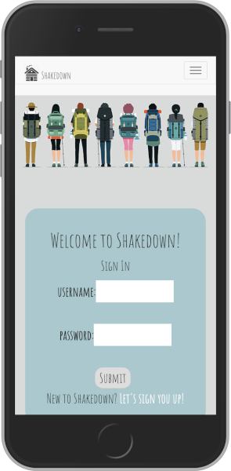

# Shakedown

<p align='center'>
    </img>
</p>

# [Live Demo](**insert web address here***)


## Overview:
QuizMe is a Node.js/Express server-rendered...  Handlebars partials were used to render the front-end views. Settings are stored in a PostgreSQL database. Additions will be made in React.    


## Built by:

[Aylin DeBruyne](https://github.com/adebruyne)  
Contributions: Express Routing, Handlebars Templeting, Querying User Preferences, UI/UX Design

[Beth D'Amato](https://github.com/badamato)  
Contributions: PostgreSQL Database Management, Querying User Preferences, AWS Deployment/Management, README.md


## Built with:

* React
* Node.js
* Express
* PostgreSQL 
* JavaScript
* Bootstrap
* Nginx
* Amazon Web Services Elastic Compute Cloud

<p align='center'>
    </img>
</p>


## Project Whiteboarding

<p align='center'>
    </img>
</p>


## Minimum Viable Product:
**User story:**  Lorem ipsum dolor sit amet, consectetur adipiscing elit. In eleifend enim at nunc aliquam, dapibus sodales libero malesuada. Maecenas non convallis arcu, quis molestie mi.

**Round description:**  Lorem ipsum dolor sit amet, consectetur adipiscing elit. In eleifend enim at nunc aliquam, dapibus sodales libero malesuada. Maecenas non convallis arcu, quis molestie mi.

- one
- two
- three
- four

**Round statistics description:**  Lorem ipsum dolor sit amet, consectetur adipiscing elit. In eleifend enim at nunc aliquam, dapibus sodales libero malesuada. Maecenas non convallis arcu, quis molestie mi.

- one
- two


## Obstacles and Breakthroughs

*Obstacle One -*
Lorem ipsum dolor sit amet, consectetur adipiscing elit. In eleifend enim at nunc aliquam, dapibus sodales libero malesuada. Maecenas non convallis arcu, quis molestie mi. Sed volutpat dignissim laoreet. Vestibulum lacinia faucibus pellentesque. Nullam et convallis mi, in rhoncus nisl. Suspendisse pretium, leo id venenatis porttitor, nulla libero sollicitudin elit, vel condimentum nisl lectus eu odio. Suspendisse in dictum mi, nec iaculis erat. Morbi eget tristique tortor. Nunc laoreet hendrerit lobortis. Nullam convallis commodo tellus, non efficitur ex finibus id.
```
add code snippet here
```

*Breakthrough One -*
Lorem ipsum dolor sit amet, consectetur adipiscing elit. In eleifend enim at nunc aliquam, dapibus sodales libero malesuada. Maecenas non convallis arcu, quis molestie mi. Sed volutpat dignissim laoreet. Vestibulum lacinia faucibus pellentesque. Nullam et convallis mi, in rhoncus nisl. Suspendisse pretium, leo id venenatis porttitor, nulla libero sollicitudin elit, vel condimentum nisl lectus eu odio. Suspendisse in dictum mi, nec iaculis erat. Morbi eget tristique tortor. Nunc laoreet hendrerit lobortis. Nullam convallis commodo tellus, non efficitur ex finibus id.
```
add code snippet here
```

*Obstacle Two -*
Lorem ipsum dolor sit amet, consectetur adipiscing elit. In eleifend enim at nunc aliquam, dapibus sodales libero malesuada. Maecenas non convallis arcu, quis molestie mi. Sed volutpat dignissim laoreet. Vestibulum lacinia faucibus pellentesque. Nullam et convallis mi, in rhoncus nisl. Suspendisse pretium, leo id venenatis porttitor, nulla libero sollicitudin elit, vel condimentum nisl lectus eu odio. Suspendisse in dictum mi, nec iaculis erat. Morbi eget tristique tortor. Nunc laoreet hendrerit lobortis. Nullam convallis commodo tellus, non efficitur ex finibus id.
```
add code snippet here
```


## Future Additions

* one
* two
* three


## License 
*Copyright 2018 Aylin DeBruyne, Beth D'Amato*

Permission is hereby granted, free of charge, to any person obtaining a copy of this software and associated documentation files (the "Software"), to deal in the Software without restriction, including without limitation the rights to use, copy, modify, merge, publish, distribute, sublicense, and/or sell copies of the Software, and to permit persons to whom the Software is furnished to do so, subject to the following conditions:

The above copyright notice and this permission notice shall be included in all copies or substantial portions of the Software.

THE SOFTWARE IS PROVIDED "AS IS", WITHOUT WARRANTY OF ANY KIND, EXPRESS OR IMPLIED, INCLUDING BUT NOT LIMITED TO THE WARRANTIES OF MERCHANTABILITY, FITNESS FOR A PARTICULAR PURPOSE AND NONINFRINGEMENT. IN NO EVENT SHALL THE AUTHORS OR COPYRIGHT HOLDERS BE LIABLE FOR ANY CLAIM, DAMAGES OR OTHER LIABILITY, WHETHER IN AN ACTION OF CONTRACT, TORT OR OTHERWISE, ARISING FROM, OUT OF OR IN CONNECTION WITH THE SOFTWARE OR THE USE OR OTHER DEALINGS IN THE SOFTWARE.
