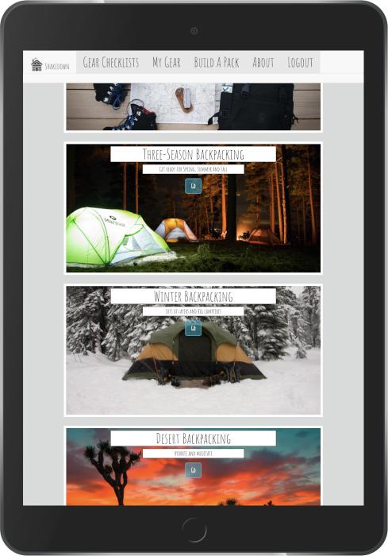
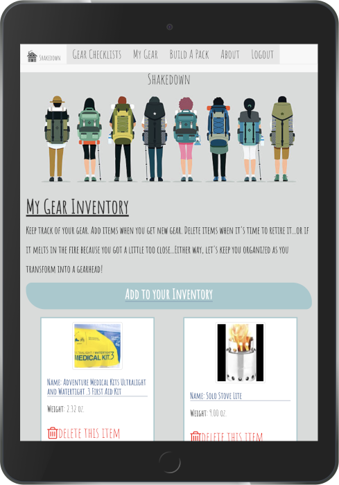
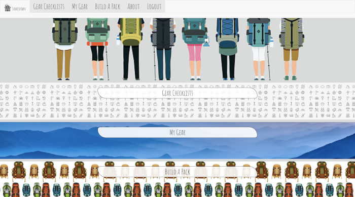
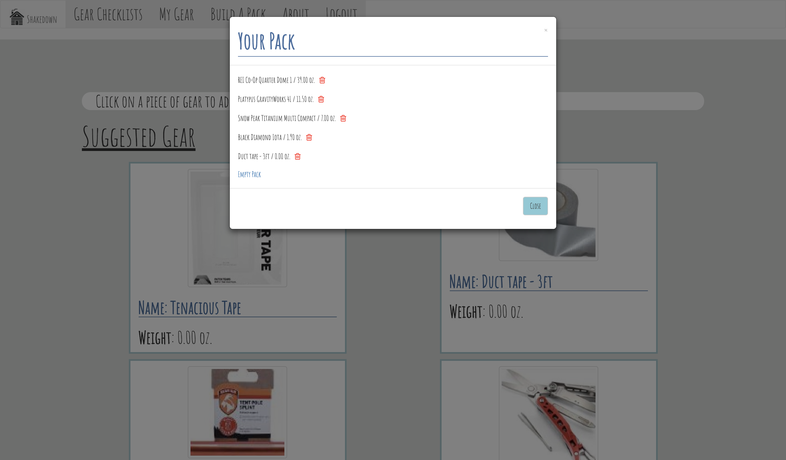
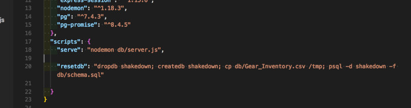

# Shakedown

<p align='center'>
    </img>
</p>

# [Live Demo](http://www.gearshakedown.net/)


## Our Mission:
At Shakedown, we are all about helping you get outside, faster. Whether you're brand new to hiking or you're seasoned hiker trash (an embraced term given to thru-hikers), we want to help you keep track of your gear and lighten the load you carry. You’ll be surprised how much pack weight can effect your backpacking experience.  Check out some of our suggested checklists for different hikes. Keep inventory of the gear you already own. Mix and match your gear in our “Build your pack” feature, and see how much your pack weighs.

Pack it up. Shake it down. Get outside.    
<br>

## Built by:

[Aylin DeBruyne](https://github.com/adebruyne)  
Contributions: React/JavaScript Framework, Node.js and Express Routing, UI/UX Responsive Design, README.md

[Beth D'Amato](https://github.com/badamato)  
Contributions: PostgreSQL Database Management, Querying User Preferences, AWS Deployment/Management, README.md, Trello Project Board
<br>

## Built with:

* React
* Node.js
* Express
* PostgreSQL 
* JavaScript
* Bootstrap
* Nginx
* Amazon Web Services Elastic Compute Cloud
<br>


<p align='center'>
    </img>&nbsp;</img>
</p>

<br>

## Minimum Viable Product:
**User story:**  All users are able to access the application's main page and the Gear Checklists page.  An authenticated user can further access the My Gear section where they are able to inventory what hike gear they currently own in order to find out what each piece weighs.  An authenticated user can move onto the the Build-A-Pack feature to add or delete items of gear in order to determine current weight.

<br>

<p align='center'>
    </img>&nbsp;</img>
</p>
<br>

## Obstacles and Breakthroughs

*Obstacle (Aylin) -*
    Understanding the relationship between components, state and and props was the hardest initial challenges. After building all the different components, we had to go back review which component was passing props to others and which ones had to keep track of state. Being new to React, all these moving pieces made it difficult to wrap our heads around. As we began building the weight component on the build-a-pack feature, everything started to click. The concepts of passing props and managing state became clearer.
    
```
        {/* Navigation */}
          
          <Route path="/" component={Navigation}/>
          
        {/* Total Weight */}
          <Route
            path="/buildapack"
            render={props => {
              return (
                <TotalWeight
                  chosenGear={this.state.selectedGear}
                  clearWeight={this._clearWeight}
                  removeOneGear={this._removeGearItem}
                  {...props}
                />
              );
            }}
          />

```

*Breakthrough (Aylin) -*
    Once the backend had been all wired up, it was time to get axios to get to work. Understanding how the frontend and backend "exchanged" information via axios was a little confusing at first- especially with all the different routes we wanted to have control of. We kept confusing our frontend routes and backend routes when making our axios requests. Our mentor was able to clearly explain the "life-cycle" of axios to us through lots of drawings and analogies. When we wired up the two, and we got our first bit of data from the database rendered to the page, we were ecstatic. It made building the other routes a lot quicker and clearer. There still is some work that needs to be cleaned up, but we were pleased with the first version.
    
```
 handleGearDelete = gear => {
    console.log(gear);
    let inv_id = gear;

    axios.post("/api/1/deletemygear", { inv_id }).then(res => {
      console.log(res);
      this._getMyGear();
    });
  };
  componentDidMount() {
    this._getMyGear();
    console.log("WOOOO get that");
  }
  _getMyGear = () => {
    //make an AJAX request to API and retrieve all categories and render array to page
    // axios.get("/api/:user_id/mygear")
    axios.get("/api/1/mygear").then(res => {
      console.log(res);
      this.setState({
        myGear: res.data
      });
    });
  };
```
<br>

*Obstacle (Beth) -*
Never ever assume that the code you serve up operates independently of your partners.  It was humbling to learn that even though I worked mostly with our database, what I was crafting had to dovetail smoothly with Aylin's code for front-end functionality.  My server routes for passing JSON data were not dependent on the UI routes but I inadvertently created extra work for Aylin in that she had to pick through my code to wire the sides together.
```
_handleSubmit = event => {
    event.preventDefault();

    axios
        .post("/api/signup/", this.state)
        .then(response => {
            if (response.data.status !== 'okay') {
                alert("Try again hiker trash!")
            }

            else {
                this.props.history.push('/')
            }
    })
        .catch(err => {
        console.log(err);
    });
};

```

*Breakthrough (Beth) -*
Prior to this project, seeding the PostgreSQL files had been done via hardcoded .SQL files.  Given the amount of data we needed to incorporate and the frequency with which we would need to swap out certain pieces, it was decided to import our data via a .CSV file.  The difficulty was our schema.sql could read the import path on one computer but when Aylin needed to reset and reference that data, the import failed.  A load script in the package.json file was written to ensure the .CSV was held in each users's temp directory so the relevant/updated information could easily be shared.

<p align='center'>
    </img>
</p>

<br>

## Project Whiteboarding

<p align='center'>
    </img>
</p>


<br>

## Future Additions

* users can save different packs they used for different trips
* users can see how their friends or others packed for certain trips
* add a contact or chat component so users can chat for advice
* run demonstration videos in side navigation
* present this application to vendors who positively support hiking, and/or offer gear for sale, to showcase on their sites

<br>

## License 
*Copyright 2018 Aylin DeBruyne, Beth D'Amato*

Permission is hereby granted, free of charge, to any person obtaining a copy of this software and associated documentation files (the "Software"), to deal in the Software without restriction, including without limitation the rights to use, copy, modify, merge, publish, distribute, sublicense, and/or sell copies of the Software, and to permit persons to whom the Software is furnished to do so, subject to the following conditions:

The above copyright notice and this permission notice shall be included in all copies or substantial portions of the Software.

THE SOFTWARE IS PROVIDED "AS IS", WITHOUT WARRANTY OF ANY KIND, EXPRESS OR IMPLIED, INCLUDING BUT NOT LIMITED TO THE WARRANTIES OF MERCHANTABILITY, FITNESS FOR A PARTICULAR PURPOSE AND NONINFRINGEMENT. IN NO EVENT SHALL THE AUTHORS OR COPYRIGHT HOLDERS BE LIABLE FOR ANY CLAIM, DAMAGES OR OTHER LIABILITY, WHETHER IN AN ACTION OF CONTRACT, TORT OR OTHERWISE, ARISING FROM, OUT OF OR IN CONNECTION WITH THE SOFTWARE OR THE USE OR OTHER DEALINGS IN THE SOFTWARE.
